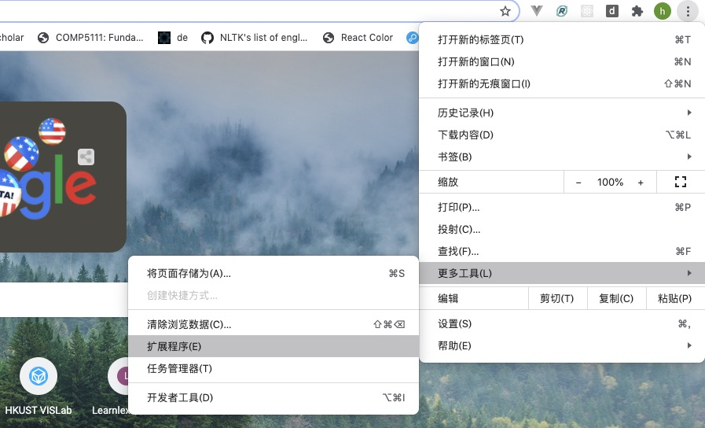
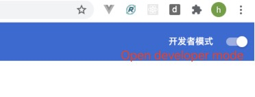
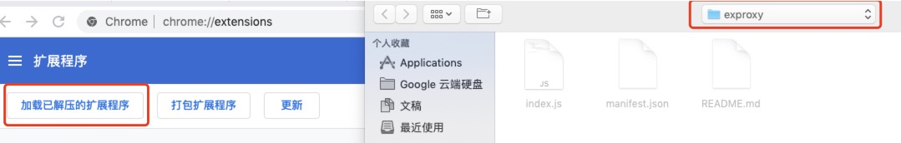
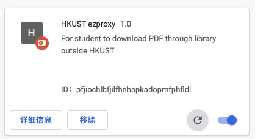
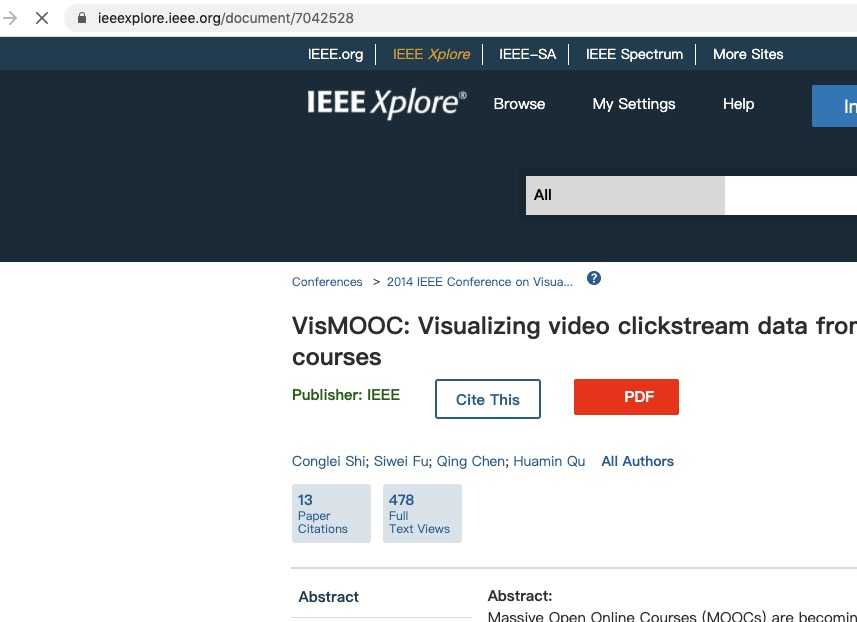
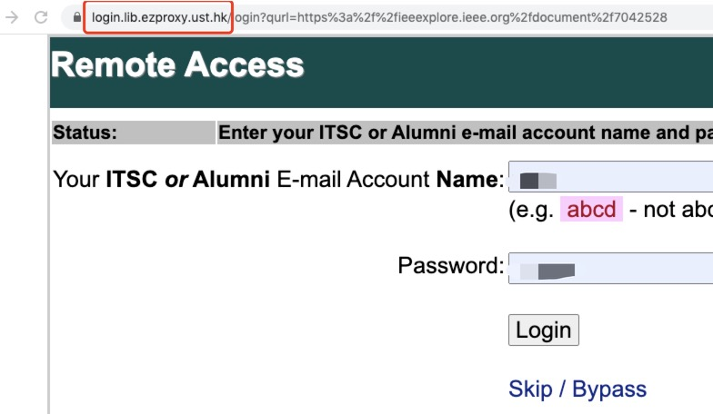
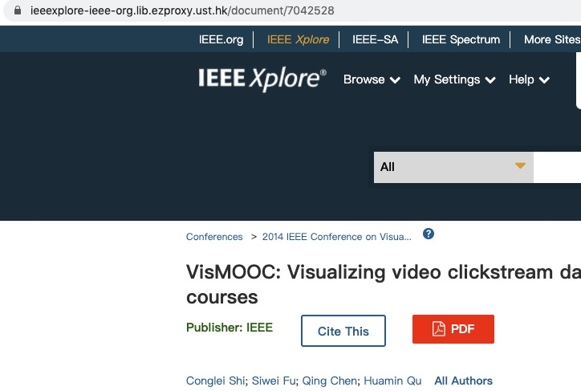

# ezproxy-plugin
HKUST ezproxy plugin, a chrome plugin, you have to be a hkust student. This plugin only help to redirect paper url through library.

## Usage
#### Step 1
* Open extensions

#### Step 2
* Open developer mode

#### Step 3
* Load unpacked program

#### Step 4
* Finally you will see this

#### Test
* Let's download this paper VisMooc https://ieeexplore.ieee.org/document/7042528 ,however no rights to access the full paper, because we are outside compus. But wait a moment, the plugin helps to redirect.

* You will see this, and you need to use your ust account login and access the paper.

* Once you login, you can download the paper now.

## Limitations
The plugin current only support the sites below:
* ieeexplore
* acm.org
* sciencedirect

## Any feedback is welcomed.
Feel free to promote issues, e.g. other websites, or links not working

